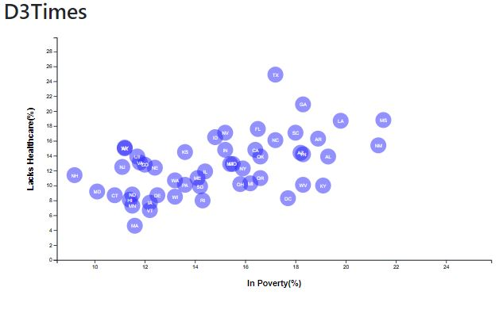

# D3-Challenge

## **D3 Dabbler** 

To create this chart:

A scatter plot between Healthcare & Poverty has been created using D3 techniques. this scatter plot represents each state with circle elements. 

* The code for this graphic is in the `app.js` file of the homework directory— the data is pulled from `data.csv` by using the `d3.csv` function. 

- The plot Includes state abbreviations in the circles.  Data for each state can be seen by hovering the mouse over the circles. 
- Note: in order to see the chart, the index.html needs to be opened in the live server.